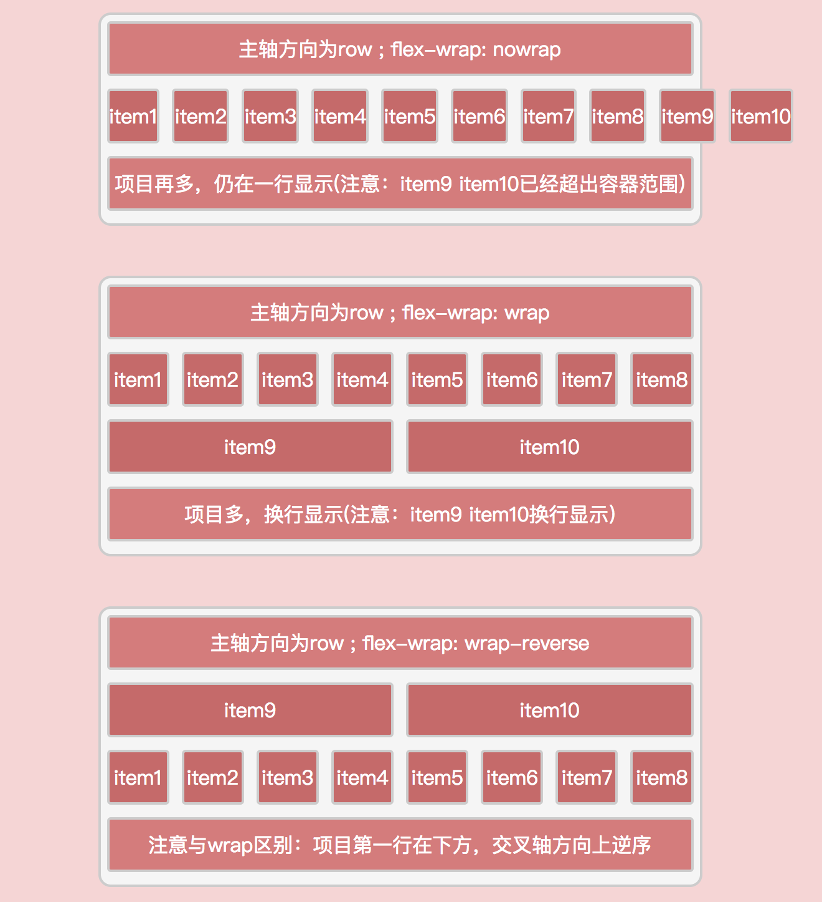
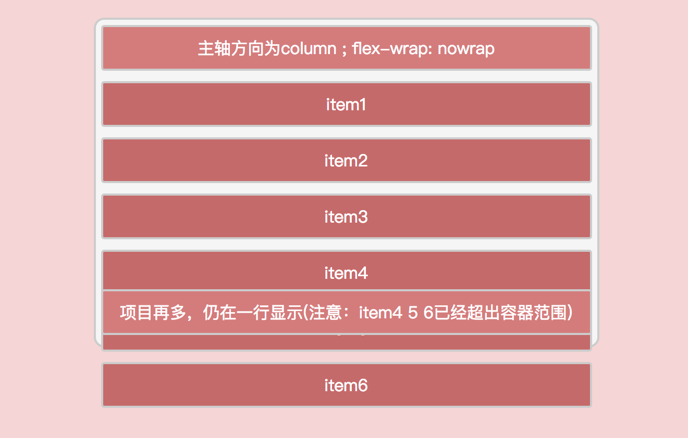
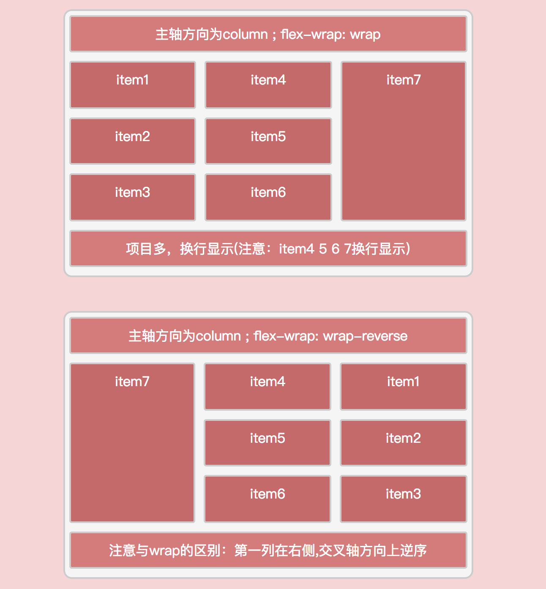
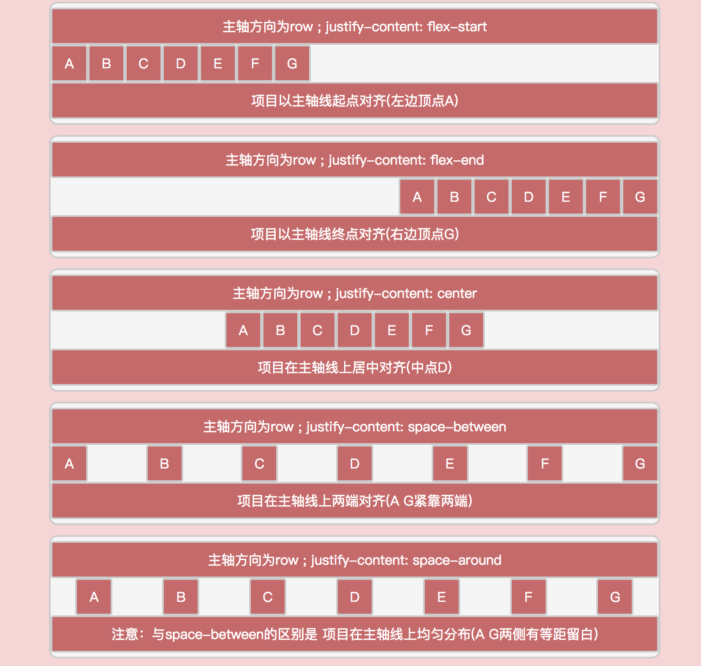
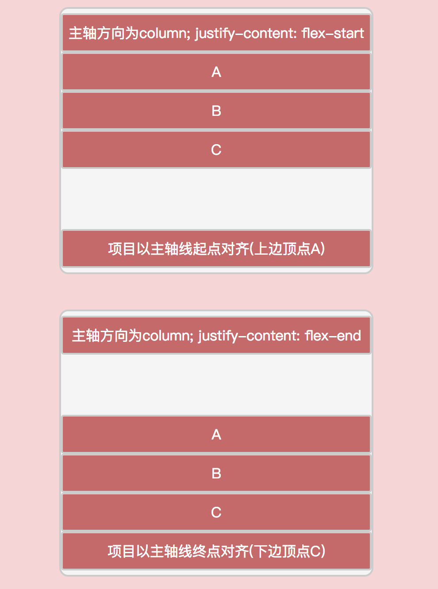
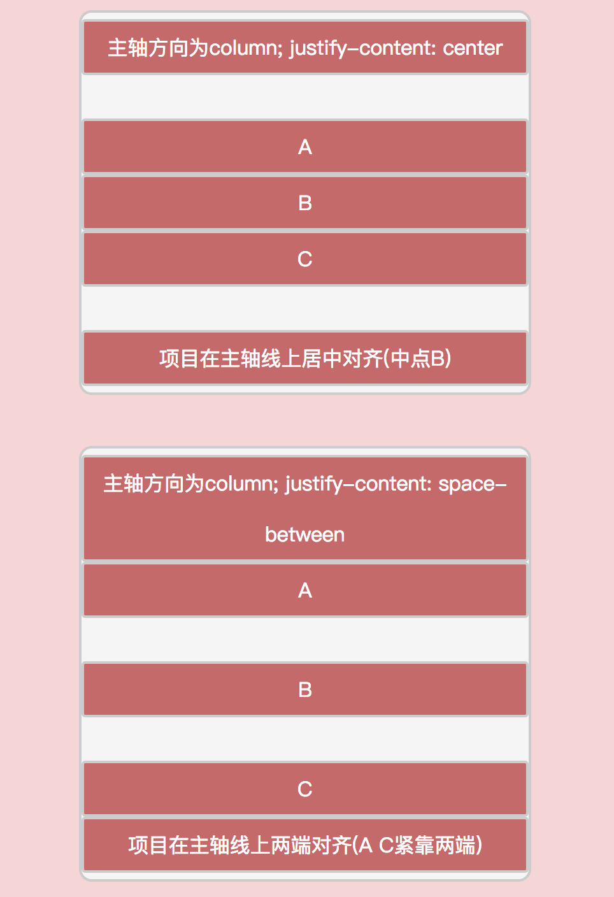
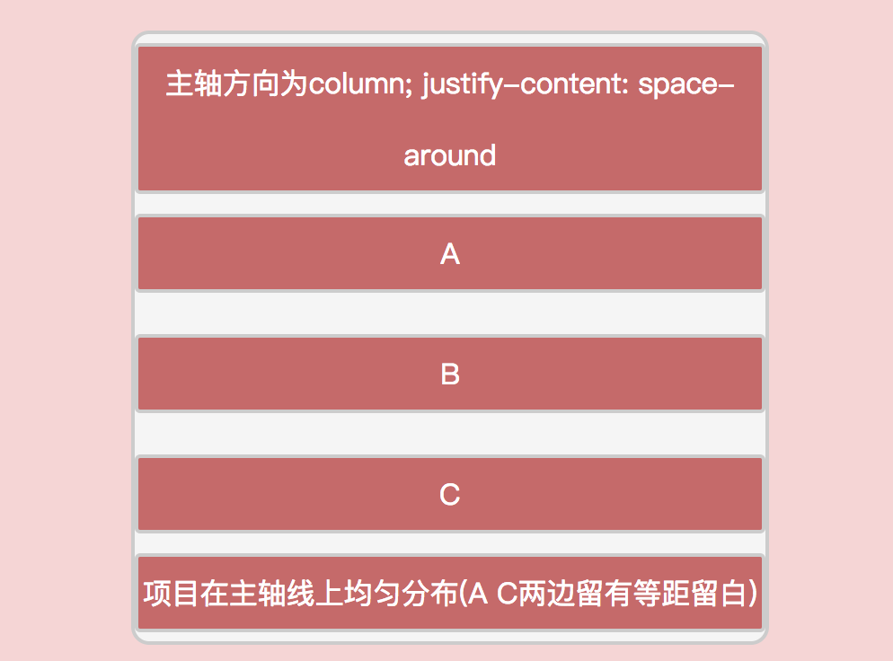

##flex基本语法##
####1.指定flex布局   
> 语法：`display: flex;`  
	 
####2.flex布局中的概念词   

* 容器：凡是设置了`display: flex`的元素都叫做flex容器
* 项目：凡是flex容器里的成员都叫flex item(项目)
* 主轴：flex容器默认存在2根轴，即主轴以及交叉轴，`flex-direaction`属性指定主轴的方向，交叉轴(辅轴)总是与主轴垂直相交。

####3.flex容器的属性  
前面我们已经知道如何将元素设置为容器了，flex容器具有6个属性。
> * flex-direction: 决定容器主轴方向;
> * flex-wrap: 决定项目在容器中是否自动换行;
> * justify-content: 决定项目在主轴方向上的对齐方式;
> * align-items: 决定了项目在交叉轴(辅轴)方向上的对齐方式;
> * align-content: 决定了沿主轴排列的项目集合在交叉轴方向上的排列方式;
> * flex-flow: flex-direction属性以及flex-wrap属性的简写方式;

##### 3.1 flex-direction属性  
> 语法：`flex-direction: row | row-reverse | column | column-reverse;`  

该属性决定了容器的主轴的方向，flex-direction可以取以下4个值。  
> * row: 缺省值，表示主轴为水平方向，起点在左;   
> * row-reverse: 表示主轴方向为水平方向，起点在右;  
> * column: 表示主轴方向为垂直方向，起点在上;  
> * column-reverse: 表示主轴方向为垂直方向，起点在下;  

详情可查看 [flex-direction 示例代码](../lesson/lesson1.html)， 效果如下图：
 

##### 3.2 flex-wrap属性  
> 语法：`flex-wrap: wrap | nowrap | wrap-reverse;`  

该属性决定了在容器主轴方向上排列的项目过多的情况下，项目是否换行显示，flex-wrap可以取以下2个值。  
> * wrap: 缺省值，表示项目自动换行显示,项目第一行在交叉轴的起点，最后一行在交叉轴的终点;   
> * nowrap: 表示所有项目排列在主轴方向的一行上，不换行显示，多出的项目会超出容器范围进行显示;   
> * wrap-reverse: 表示项目自动换行显示，和wrap的区别是，项目第一行在交叉轴的终点，末行在交叉轴的终点;

详情可查看 [flex-wrap示例代码](../lesson/lesson2.html)， 效果如下图：  

##### 3.3 justify-content属性  
> 语法：`justify-content: flex-start | flex-end | center | space-between | space-around;`  

该属性决定了项目在主轴方向上的对齐方式，flex-direction可以取以下4个值。  
> * flex-start: 缺省值，表示各个项目以主轴的起点处对齐;   
> * flex-end: 表示表示各个项目以主轴的终点处对齐;  
> * center: 表示各个项目在主轴线上居中对齐;  
> * space-between: 表示各个项目在主轴线上两端对齐 ==> 项目之间的间隔都相等; 
> * space-around: 表示各个项目在主轴线上等分布(均匀分布),即项目左右两边留白相同 ==> 每个项目两侧的间隔相等，项目之间的间隔比项目与边框的间隔大一倍; 

详情可查看 [justify-content 示例代码](../lesson/lesson3.html)， 效果如下图：
 

