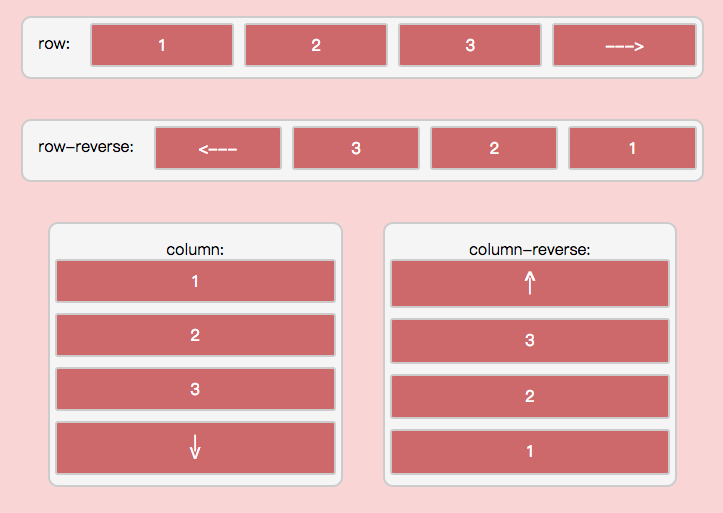

#### 3.1 flex-direction属性  
> 语法：`flex-direction: row | row-reverse | column | column-reverse|initial|inherit;`  

该属性决定了容器的主轴的方向，flex-direction可以取以下6个值。 
> * initial: 设置该属性为默认值，经测试web端默认值为 row, app端默认值为 column;
> * row: 表示主轴为水平方向，起点在左;   
> * row-reverse: 表示主轴方向为水平方向，起点在右;  
> * column: 表示主轴方向为垂直方向，起点在上;  
> * column-reverse: 表示主轴方向为垂直方向，起点在下;
> * inherit: 从父元素继承属性值;

####浏览器支持情况：
主流浏览器都支持该属性，下表表示的是支持该属性的浏览器的版本号：  

| 属性 |   | |  | | 
|------| ------ | ------|-------| --------|---------|
| flex-direction| IE | chrome |  firefox | safari | opera|

详情可查看 [flex-direction 示例代码](../lesson/lesson1.html)， 效果如下图：
 

